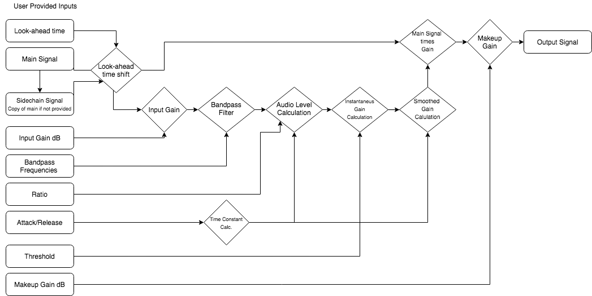
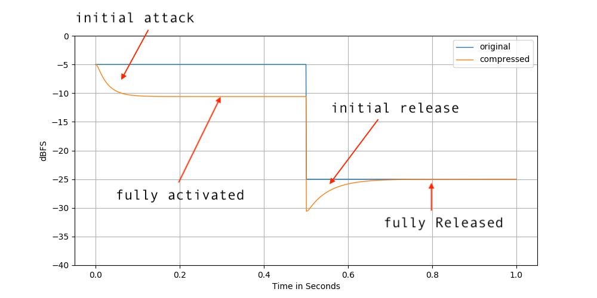
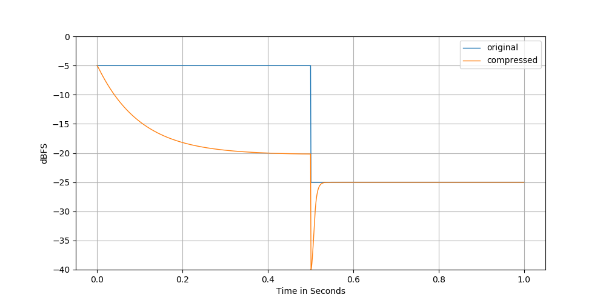
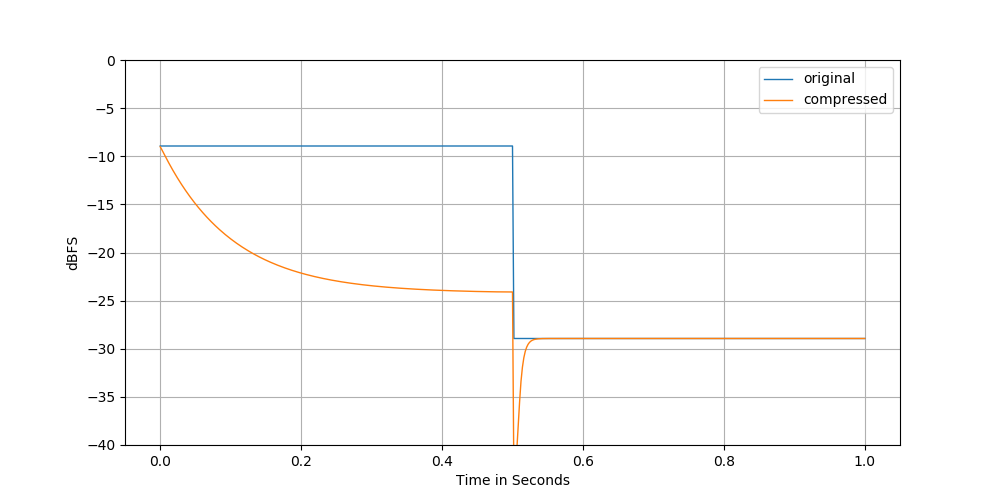
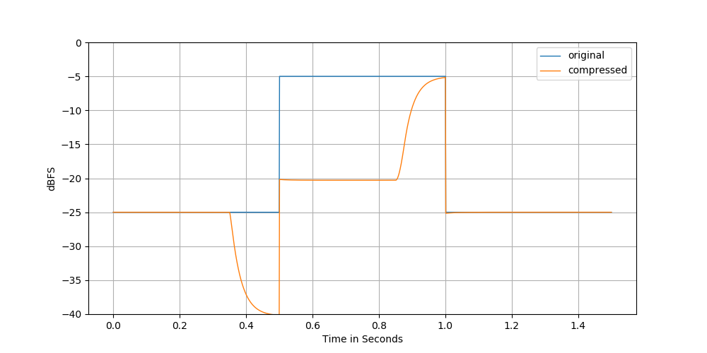
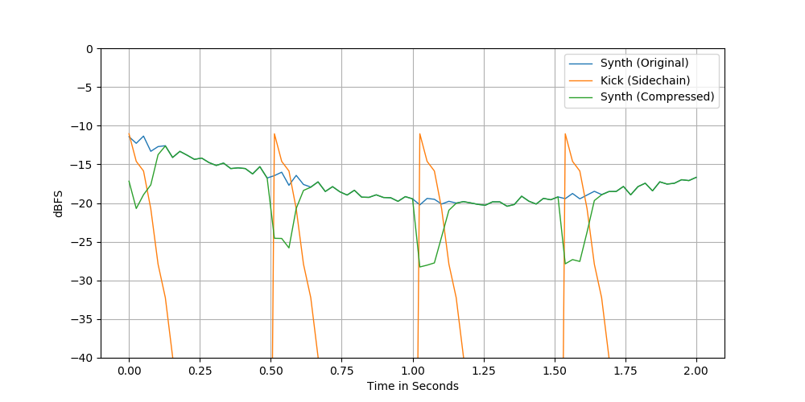
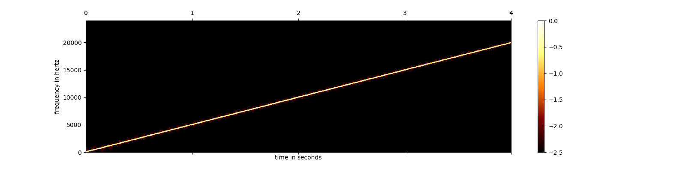
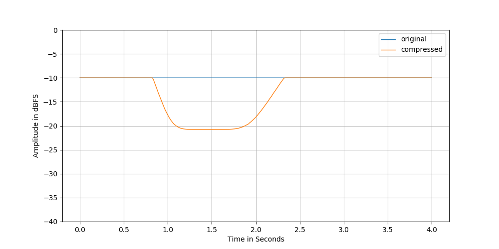
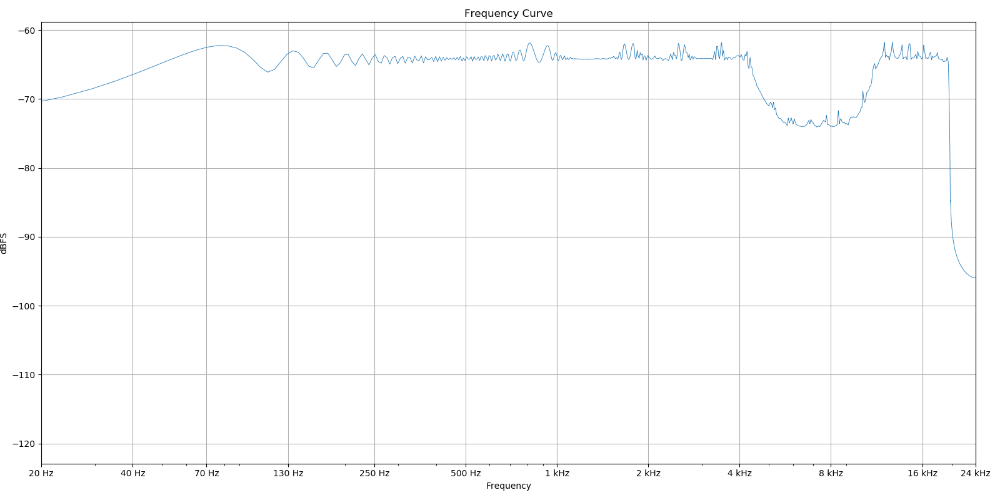
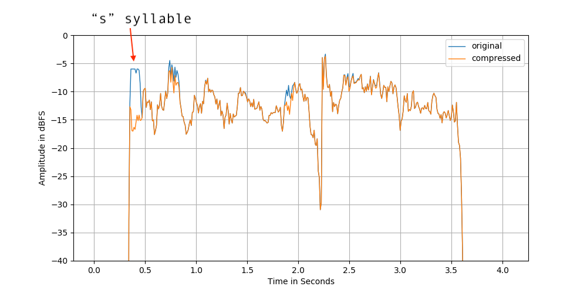

Audio Plugin written in C++. Used for controlling the dynamics of audio signals.

During this project I learned alot about analysing and plotting signals.
The source code for the plugin is available [here](https://github.com/jadujoel/audio-compressor).

Before turning it into an application usable in productions I developed a test
in Python and wrote a report on that test.
The Python code is available [here](https://github.com/jadujoel/audio-compressor-python).

## 1. Introduction

The compressor is a versatile tool commonly used to change the dynamics and shape
the tone of the sound, and this document will first describe it’s common parameters
and what they do.
Then it will analyse one specific compressor written in Python,
first the attack and release times, then look-ahead and side-chaining.
Lastly there will be a summary of results and discussion.

### Parameters

Here are some definitions for common parameters of a compressor,
not all compressors have all of these parameters, and some have more.

#### Input Gain

Adjusts the static gain before the gain calculations.

#### Threshold

Sets the amplitude the signal must be above to set the compressor into attack mode. Or conversely, the amplitude the signal must be below for the compressor to set into release mode.

#### Knee / Soft Knee / Hard Knee

Changes the interaction between threshold and ratio. Using a soft knee, the compressor will approach a softer ratio once the signal passes the soft threshold, working towards the higher ratio as the signal amplitude increases. While a hard knee will start working towards the set ratio as soon as the signal passes threshold.

#### Ratio

The amount of gain reduction to apply once the attack has fully kicked in. The compressor will apply a ratio ranging from 1:1 to the ratio set when fully activated. A steady signal at 0dBFS with a threshold of -10dBFS and a ratio at 2 will end up at -5dBFS once the attack has fully kicked in. A compressor with a ratio of 10 or higher is usually referred to as a limiter.

#### Attack Time / Release Rate

Manufacturers vary in their way to define attack time, but a common definition is how long time it takes to apply for roughly two thirds of the gain adjustment to be applied, e.g in the example above, how long time it would take for the ratio to be at 1.66 and the amplitude to be at -3.3 dBFS. Another definition is how long it takes to apply X dB of gain reduction, where X is fluid.
A very short attack time can introduce audible distorsion.

#### Release Time / Release Rate

Same as attack time but for when the gain adjustment returns to none or ratio returns to 1:1. A fast release introduces similar characteristics as a fast attack. A slow release can introduce “pumping”.

#### Look-Ahead

Some compressors allow to look ahead at the signal on what come may. To start start the attack or release phase before the amplitude changed to above or below threshold. This inevitably introduces a delay related to the look-ahead time. But can give a smoother sound especially when hard peak-limiting signals.
Output Gain / Makeup Gain
Adjust the static gain after the compression.

#### Sidechain

Some compressors allow for the use of a side chain signal. Where that secondary signal will allow the gain on the main signal be changed based on the level of the side chain signal. Perhaps most commonly used in dance music to duck instruments when the kick hits.
2 of 9
Sometimes there is also the ability to filter the side chain signal. For example cutting out lower frequencies, basically allowing it to be used as a de-esser.

## 2. Method

Inside the folder “attachments” you will find audio files, source code, and plots relating to this text. If you wish to run the code. You would need python 3.8 and the some dependencies. In that case ‘main.py' can also be used to generate the examples we will get to later.
Plots are made using the python library for matplotlib, pyplot, and math graphs using matcha.io. Signal flow chart was made with draw.io.
Overview
We’ll take a look at one specific digital compressor. For this assignment I looked at the c++ code for a compressor I found [here](http://openaudio.blogspot.com/2017/01/basic-dynamic-range-compressor.html), I then translated the code into python and added some bells and whistles of my own. Such as side-chain filtering and look-ahead.
Here is an overview made of how the logic of the compressor is set up.

To the far left are the user provided parameters. In this plot, “Main Signal” means the audio to be compressed. Sidechain Signal mean the audio that are used to calculate the compression amount. If a separate sidechain signal is not provided by the user, the compressor will use a copy of the main signal instead.
Now we’ll look at some examples of what it does to a signal, audio files before and after compression, as well as the plots are included in the ‘attachments’ folder.

### Example 1 - Attack and release

The code for this example is in ‘main.py’ under function ‘example_one()’
Shown below is an example with a 1kHz sine wave starting at -5 dBFS amplitude, changing instantly to -25dBFS after 0.5 seconds.

To plot the amplitude of the signal, I’ve divided the signal into 1 millisecond frames and taken the max of the absolute values at each frame. Then taken the log of the absolute values of that, multiplied by 20, to the y-axis in decibel full scale. So amplitude = 20 * log10(max(|frame|))
The compressor parameters were as follows:

- attack = 25 ms
- release = 50 ms
- ratio = 5
- threshold = -15 dBFS

Original:

<audio src="/compressor-plugin/ex1_sine_original.mp3" controls></audio>

Compressed:

<audio src="/compressor-plugin/ex1_sine_compressed.mp3" controls></audio>

We can see that compressor pushes the amplitude down when the level is above threshold, and lets go when its below threshold.
A notable mention, in his blogpost Chip stated that the attack and release times seemed to be correct, based on applying 63 % of the gain adjustment in the set time. However, the time constants are simply set by doing:

<math>timeConstant = e^(-1 / time / 5 * sampleRate)</math>

Which doesn’t always seem to provide 63% of compression at the set attack/release times. At least in my trials.

### Example 2 - Attack, Release and Threshold

Alright, so gain adjustments seems to be working as intended. Lets try another setting.

- attack = 0.1
- release = 0.005
- ratio = 10
- threshold = -25

Original:

<audio src="/compressor-plugin/ex2_sine_original.mp3" controls></audio>

Compressed:

<audio src="/compressor-plugin/ex2_sine_compressed.mp3" controls></audio>

As we can see here, while the higher ratio and lower threshold makes for a larger gain adjustment when fully activated, the longer attack time makes for a gentler curve. Inversely, the shorter release makes for quick release of gain adjustment after the signal has passed below the threshold.

But wait, the gain adjustment seems to be off. The difference between the threshold of <math>-25 - 5 = 20</math> And <math>20 ratio = 20 / 10 = 2</math>

So the result should lie at: <math>-25 dBFS + 2 dBFS = -23 dBFS</math>

However, the actual result above shows the signal moving towards <math>-20 dBFS</math> at the attack phase. Which is <math>3 dBFS</math> off.

After some trial and error I found that the threshold setting in the compressor I’ve implemented seems to be consistently about *4dBFS* off on sine wave, but found an explanation; in the plot, we are looking at the peak amplitude at every *1ms* frame, however, the compressor is not, it is looking at a low passed smoother signal based on the rate of the shortest of either attack or release-times divided by *5*, but never at no less than *2ms*. In the example above, that would mean it choose the *2ms* time for the low-pass constant.

<math>lowPassTime = min(attackTime, releaseTime)</math>

If we instead plot the signal using the mean of the absolute values, in frames of *2ms*. We see that the lower sine amplitude will indeed not be located at *-25dBFS*, but closer to *-29dBFS*. Which does account for the *4dB* difference.

As we can see here, the amplitude is around *16dBFS* above threshold.

- <math>16 / 10 = 1.6</math>
- <math>-25 + 1.6 = -23.4</math>

Which seems decently close to what the compressor should be outputting.

### Example 3 - Lookahead

Original:

<audio src="/compressor-plugin/ex3_original.mp3" controls></audio>

Compressed:

<audio src="/compressor-plugin/ex3_compressed.mp3" controls></audio>

Above is the output we get when using lookahead in the compressor. As we can see the comp starts to react before the signal has gone above/below threshold. This could be useful if we want to make sure that absolutely no signal goes above *0dBFS* for example without setting such a low attack time that it would cause distortion. We achieve the lookahead function by rolling the signal array to the right after the level has been calculated, but before the gain is being applied. We need to take care of the edges though (before and after the signal starts/ends). We do this by first padding the end, and then after rolling and applying gain. We strip the beginning of the resulting signal, which is just a zero pad after the roll.

### Example 4 - Sidechaining

In this example we’ll replicate the pumping effect commonly used in dance music. We’ll feed a synth as the main signal, and use a *4 on the floor* kick drum to feed the level calculations, acting as sidechain input.

Original:

<audio src="/compressor-plugin/ex4_original.mp3" controls></audio>

Sidechain:

<audio src="/compressor-plugin/ex4_sidechain.mp3" controls></audio>

Compressed:

<audio src="/compressor-plugin/ex4_compressed.mp3" controls></audio>

Here we see and hear the synth “ducking” when the kick hits. While the compressor is not reacting to the level of synth signal itself, only adjusting the gain from the level calculations on the sidechain signal. It’s working!

### Example 5 - Sidechain Filtering

In this example we’ll use the original signal as sidechain, but with a filter applied to it to see if we can get it react differently based on the signal frequency material.

First, we’ll create a “chirp”, a sine wave sweeping from *20Hz* to *20kHz* over four seconds.

Then we’ll compress it, but use a bandpass filter before the compressors level estimator. We’ll set the low-cut to *5kHz*, and high-cut to *10kHz*.

If we look at figure 7 and 8. We can see that the compressor starts working only as the chirp encloses the band-passed frequencies.  And if we plot the frequency curve of the compressed signal. We can see the effect of the filter again. Please note that we are not band-passing the original signal itself. Only the copy of that signal that the level estimator uses to estimate gain.

Original:

<audio src="/compressor-plugin/ex5_original.mp3" controls></audio>

Compressed:

<audio src="/compressor-plugin/ex5_compressed.mp3" controls></audio>

### Example 6 - De-Esser

Now we’ll use the functionality demonstrated in the last example to create a de-esser, lowering the sibilant sounds in a voice while (hopefully) leaving the rest intact.

Original:

<audio src="/compressor-plugin/ex6_original.mp3" controls></audio>

Compressed:

<audio src="/compressor-plugin/ex6_compressed.mp3" controls></audio>

And it seems to have worked. The harsh “s” in the beginning of the phrase is now less deafening. While the rest remains largely unaffected.

## 3. Results / Discussion

We looked into some different use cases for a compressor in our different examples.
We talked about the definition af attack & release times and how it’s not always straight-forward to know exactly, and we learned that the attack time is usually not defined as the time it takes for the compressor to reach its full ratio, which is what I thought before. I also learned that at least for this compressor: the compressor works towards the set ratio faster in the beginning of the attack phase than than the end. It's a slope rather than a straight line.

At first I tried to make a compressor by thinking about how a compressor works. When I did that I failed to get the level estimation and levelling envelope to work as intended. Which created a lot of unintentional distortion. Looking at the c++ code helped me understand how the math for creating the envelope could be implemented.

Artistically, I find that compression when done with a clear purpose and intention can have a big positive impaction the end listening experience. While compression made out of habit or just simply “because you should”, without any purpose can be quite haphazard and I’d rather not unless there is a clear benefit.

Thank you for reading!
