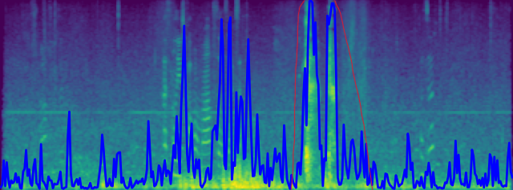

<style>
math {
  display: inline-block;
  color: white;
}
</style>

## Introduction

This report delves into the realm of Sound Event Detection, with a focus on detecting human coughs to understand the intricacies involved in training an audio classification model.

## Preparing the Data

Data diversity is key for any machine learning model. I crafted a script that blends cough sounds with random ambient noises, simulating real-world scenarios. This approach ensured that the model isn't skewed towards specific background noises. Using this methodology, I expanded the available `56` cough files and `15` ambient files into a dataset of `2048` varied samples.


The mel spectrogram of the mix3_cough_train audio file along with cough confidence label

Some of the data was labeled with non boolean confidences like the one above. And some where the label was always 100% sure whether there was a cough at a given time or not.

## Model Architecture and Training

Given the dataset at hand, I leaned towards a 1D Convolutional Neural Network (CNN) using TensorFlow and Keras. The architecture is relatively simple, keeping in mind the size and diversity of the dataset as well as the time and resource constraints regarding training of the actual mode.

The model's structure is

```python
Sequential([
    Conv1D(64, kernel_size=5, input_shape=(128, 1)),
    BatchNormalization(),
    Activation('relu'),
    MaxPooling1D(pool_size=2),
    Dropout(0.2),
    Conv1D(128, kernel_size=5),
    BatchNormalization(),
    Activation('relu'),
    MaxPooling1D(pool_size=2),
    Dropout(0.2),
    Flatten(),
    Dense(64, activation='relu'),
    Dropout(0.5),
    Dense(1, activation='sigmoid')
])
```

The model was trained for `32` epochs with a batch size of `256` and a train / validation split of `80/20`, checkpoints were saved periodically.

## Evaluation and Results

For evaluation, I recorded various cough sounds in different settings. The model's performance was decent on clear coughs. However, its ability to discern coughs in noisier environments was a challenge. This highlighted the need for either more diverse training data or, preferably, the collection of more real-world cough samples.

The model achieved an accuracy of 93% on the validation set.

The results were visualized by overlaying prediction confidence on Mel spectrograms, offering a snapshot of the model's performance.

---


This is the result on the same file we saw in the data preparation section, so part of data the model has trained on. We can see the similarities to the original label so the model seems to have some semblance of understanding as to what the task is.

---



This was the result on unseen data from a windy forum, the area marked in red are actual coughs.

---


This was the result on unseen data from a clean recording in studio environment. And it predicts the coughs accurately.

---

## Conclusion

This quick case study shed light on the challenges associated with audio classification tasks. While the results indicate areas for improvement, the study serves as a foundational step towards building more robust audio classifiers in the future.

In the real-world setting, the model could be integrated into wearable health monitors or smart home systems. However, to be robustly usable in varied environments, further refinement in handling noisy backgrounds is essential. Future endeavors could involve experimenting with more complex architectures, data augmentation techniques, or incorporating additional real-world audio data.

---
