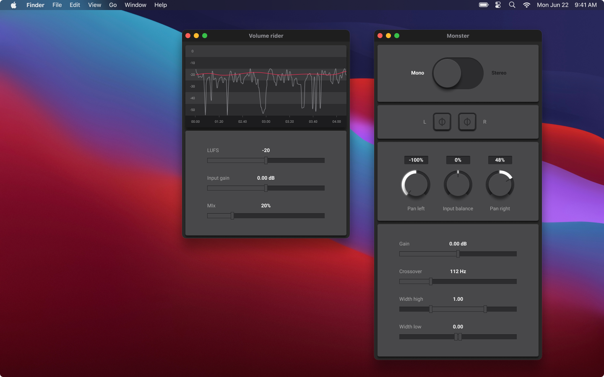

## Overview

I am excited to present **Monster**, an audio plugin specifically designed to manipulate the stereo field in audio production. Created in collaboration with my brother [Anton](https://www.antonlof.com/#monster) who designed the user interface, Monster is a seamless blend of functionality and user experience.

## Design Objectives

The plugin is crafted to be intuitive yet potent, adeptly resolving a variety of challenges commonly encountered in both podcast and music production. Its interface forgoes traditional image-based assets to ensure maximum performance and versatility.

Monster is built on a solid foundation of C++ and leverages the capabilities of the well-regarded JUCE framework. This allows for robust, high-performance operation suitable for professional audio environments.

## Access the Code and Pre-built Binaries

For those interested in diving deeper or customizing the utility, the source code, along with some pre-compiled binaries, is readily accessible on the project's [GitHub repository](https://github.com/jadujoel/monster)
