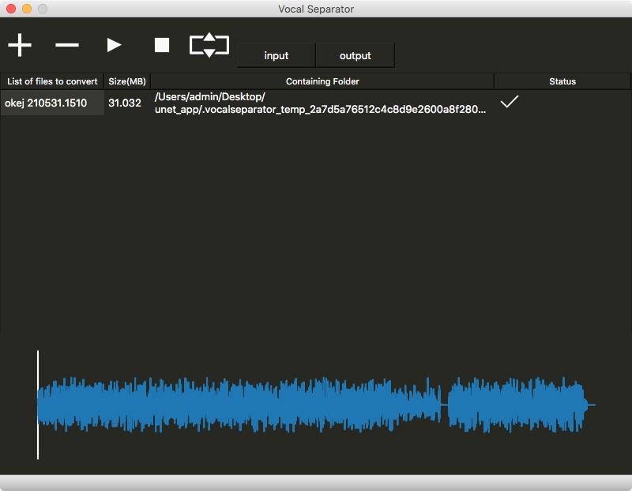

## Project Summary

This audio processing application leverages machine learning techniques to isolate vocal and instrumental components within a musical track. The application was built using Python and is empowered by a series of specialized libraries and tools such as TensorFlow, Keras, and the FloydHub cloud service for scalable computational resources.



## Demo & Examples

Here's a glimpse into the application's capabilities:

<video
  src="ex1.mp4"
  poster="ex1Poster.png"
  preload="metadata"
  width="100%"
  height="100%"
  tabindex="0"
  title="Demo of Music Source Separation"
  type="video/mp4"
  controls
/>

Additionally, I've provided some audio examples to demonstrate the application's ability to separate vocals from instrumentals. Note that these samples are proofs of concept and may contain imperfections that are being addressed in ongoing work.

- Original Mix:

<audio src="okej-210531.1510.mp3" controls></audio>

- Separated Vocal + Instrumental:

<audio src="okej-210531.1510_mix_LR.mp3" controls></audio>

- Original Instrumental:

<audio src="okej-210531.1510_ins_org.mp3" controls></audio>

- Separated Instrumental:

<audio src="okej-210531.1510_ins_LR.mp3" controls></audio>

- Original Vocal:

<audio src="okej-210531.1510_voc_org.mp3" controls></audio>

- Separated Vocal:

<audio src="okej-210531.1510_voc_LR.mp3" controls></audio>

## Background & Motivation

My fascination with audio signal processing and machine learning led me to tackle the complex challenge of separating distinct elements, like vocals and instrumentals, in a given sound mix. The ability to isolate these components mimics human cognitive processes, where we can focus our auditory attention on specific elements within a complex acoustic environment—like hearing a single conversation in a noisy room or identifying the rustle of leaves amidst bird songs. This cognitive skill has always struck me as awe-inspiring and I was thrilled at the prospect of building a machine learning application that could replicate this capability.

## Technical Details

### The Model

The architecture of this application is largely inspired by a [research paper](https://openaccess.city.ac.uk/id/eprint/19289/1/) that applied a modified UNet neural network originally designed for medical imaging. The authors adapted the UNet to work on spectrograms, which are 2D representations of sound where the x-axis corresponds to time, the y-axis to frequency, and pixel brightness represents sound intensity.

The UNet model was trained using supervised learning methods. Essentially, it learns to associate a given song with its corresponding acapella vocal track. During training, the network adjusts its internal parameters to minimize the difference between its output and the original acapella track.

#### Code Excerpt for UNet Model

Below is a Python code snippet illustrating the architecture of the UNet model, used for music source separation in this project.

```python
import tensorflow as tf
from tensorflow.contrib import keras as keras
from keras import models, layers

class UNet():
  def create_model (self,
      img_shape = (512, 128, 1),
      use_dropout = True):
    '''
      Inputs: an image of shape
        (batch, rows, cols, np.newaxis())
      The encoder part (c1  -> c6) uses leaky relu.
      The decoder part (dc5 -> dc1) uses relu.
      Transposed convolution = Deconvolution
      The decoder part uses dropout
        in the first three layers
      Keras uses dropout when training
        but not when .predict
    '''
    self.use_dropout = use_dropout
    alpha = 0.2       # Amount of leakiness.
    concat_axis = 3   # Concatenate over the filters
    params = {
      "kernel_size": (5, 5),
      "strides": (2, 2),
      "padding": 'same',
    }

    # Applied to the first three deconvolution layers
    self.dropoutParams = {
      "rate": 0.5,
      "noise_shape": None,
      "seed": None,
    }

    # Input
    inputs = layers.Input (
      shape = img_shape,
      name = 'input'
    )

    # Encoder 1
    c1 = layers.Conv2D (
      name = 'c1',
      filters = 16,
      activation = 'linear',
      **params,
    ) (inputs)

    c1 = layers.LeakyReLU (alpha = alpha) (c1)
    c1 = layers.BatchNormalization () (c1)

    # Encoder 2
    c2 = layers.Conv2D (
      name = 'c2',
      filters = 32,
      activation = 'linear',
      **params,
    ) (c1)

    c2 = layers.LeakyReLU (alpha = alpha) (c2)
    c2 = layers.BatchNormalization () (c2)

    # Encoder 3
    c3 = layers.Conv2D (
      name = 'c3'
      filters = 64,
      activation = 'linear',
      **params,
    ) (c2)

    c3 = layers.LeakyReLU (alpha = alpha) (c3)
    c3 = layers.BatchNormalization () (c3)

    # Encoder 4
    c4 = layers.Conv2D (
      filters = 128,
      name = 'c4'
      activation = 'linear',
      **params,
    ) (c3)

    c4 = layers.LeakyReLU (alpha = alpha) (c4)
    c4 = layers.BatchNormalization () (c4)

    # Encoder 5
    c5 = layers.Conv2D (
      name = 'c5'
      filters = 256,
      activation = 'linear',
      **params,
    ) (c4)

    c5 = layers.LeakyReLU (alpha = alpha) (c5)
    c5 = layers.BatchNormalization () (c5)

    # Encoder 6
    c6 = layers.Conv2D (
      name = 'c6'
      filters = 512,
      activation = 'linear',
      **params,
    ) (c5)

    c6 = layers.LeakyReLU (alpha = alpha) (c6)

    c6 = layers.BatchNormalization () (c6)

    # Decoder 5
    dc5 = layers.Conv2DTranspose (
      name = 'dc5'
      filters = 256,
      activation = 'relu',
      **params,
    ) (c6)

    dc5 = layers.BatchNormalization () (dc5)
    dc5 = self.addDropout (dc5)

    # Concat 5
    ch, cw = self.getCropShape (c5, dc5)

    c5_crop = layers.Cropping2D (
      cropping = (ch,cw)
    ) (c5)

    cc5 = layers.concatenate (
      [dc5, c5_crop],
      axis = concat_axis
    )

    # Decoder 4
    dc4 = layers.Conv2DTranspose (
      name = 'dc4'
      filters = 128,
      activation='relu',
      **params,
    ) (cc5)

    dc4 = layers.BatchNormalization () (dc4)
    dc4 = self.addDropout (dc4)

    # Concat 4
    ch, cw = self.getCropShape (c4, dc4)

    c4_crop = layers.Cropping2D (
      cropping = (ch,cw)
    ) (c4)

    cc4 = layers.concatenate (
      [dc4, c4_crop],
      axis = concat_axis
    )

    # Decoder 3
    dc3 = layers.Conv2DTranspose (
      name = 'dc3'
      filters = 64,
      activation = 'relu',
      **params,
    ) (cc4)

    dc3 = self.addDropout (dc3)

    # Concat 3
    ch, cw = self.getCropShape (c3, dc3)

    c3_crop = layers.Cropping2D (
      cropping = (ch,cw)
    ) (c3)

    cc3 = layers.concatenate(
      [dc3, c3_crop],
      axis = concat_axis
    )

    # Decoder 2
    dc2 = layers.Conv2DTranspose (
      filters = 32,
      name = 'dc2'
      activation = 'relu',
      **params,
    ) (cc3)

    dc2 = layers.BatchNormalization () (dc2)

    # Concat 2
    ch, cw = self.getCropShape (c2, dc2)

    c2_crop = layers.Cropping2D (
      cropping = (ch,cw)
    ) (c2)

    cc2 = layers.concatenate (
      [dc2, c2_crop],
      axis = concat_axis
    )

    # Decoder 1
    dc1 = layers.Conv2DTranspose (
      name = 'dc1'
      filters = 16,
      activation = 'relu',
      **params,
    ) (cc2)

    dc1 = layers.BatchNormalization () (dc1)

    # Concat 1
    ch, cw = self.getCropShape (c1, dc1)

    c1_crop = layers.Cropping2D (
      cropping = (ch,cw)
    ) (c1)

    cc1 = layers.concatenate (
      [dc1, c1_crop],
      axis = concat_axis
    )

    # Output
    mask = layers.Conv2DTranspose (
      name = 'mask'
      filters = 1,
      activation = 'sigmoid',
      **params,
    ) (cc1)

    mask = layers.BatchNormalization () (mask)

    ''' Concatenated because we need access to both
      input and output in our custom loss model. '''
    output = layers.concatenate(
      [inputs, mask],
      axis = 3
    )
    model = models.Model (inputs = inputs, outputs = [output])

    return model

  def getCropShape (self, target, refer):
    # width, the 3rd dimension
    cw = (target._keras_shape[2] - refer._keras_shape[2])
    assert (cw >= 0)

    if cw % 2 != 0:
      cw1, cw2 = int(cw/2), int(cw/2) + 1
    else:
      cw1, cw2 = int(cw/2), int(cw/2)

    # height, the 2nd dimension
    ch = (target._keras_shape[1] - refer._keras_shape[1])
    assert (ch >= 0)

    if ch % 2 != 0:
      ch1, ch2 = int(ch/2), int(ch/2) + 1
    else:
      ch1, ch2 = int(ch/2), int(ch/2)

    return (ch1, ch2), (cw1, cw2)

  def addDropout(self, tensor):
    if self.use_dropout():
      return layers.Dropout (**self.dropoutParams) (tensor)
    return tensor

  # We need to make static method
  # because keras wont pass the object proper
  @staticmethod
  def l1norm (y_true, y_pred):
    ''' Custom Loss function
      L1,1 norm of the difference of the target spectrogram
      and the masked input spectrogram '''

    # Get model input
    mix = tf.slice (
      y_pred,
      [0, 0, 0, 0],
      [-1, -1, -1, 1],
    )

    # Get model output
    mask = tf.slice (
      y_pred,
      [0, 0, 0, 1],
      [-1, -1, -1, -1],
    )

    '''' Multiply the input spectrogram
      with the mask generated by the model
      to get the spectrogram for the
      acapella or intrumental '''

    y_pred = tf.multiply(mix, mask)

    ''' Calculate the cost based on the distance
      from the provided source truth "label" '''
    _loss = tf.reduce_mean (
      tf.reduce_sum (
        tf.abs (
          tf.subtract (y_pred, y_true)),
        axis = (1,2,3)
      )
    )

    return _loss
```

The code details the architecture of the neural network, incorporating various layers such as Conv2D, LeakyReLU, and BatchNormalization, as well as methods for calculating loss and optimizing parameters.

## Loss Function

$$L(X, Y;\Theta) = ||(f(X, \Theta) \odot X - Y)|| _{1,1}$$

## Future Work

While the current model demonstrates the feasibility of the concept, there are opportunities for further refinement to improve the quality of separation and reduce auditory artifacts. Some avenues include employing more sophisticated training techniques, augmenting the dataset, and potentially incorporating additional features for better generalization.

### Conclusion

This project is a step forward in the pursuit of creating intelligent systems capable of auditory scene analysis, similar to human cognition. It holds a wide range of applications—from enhanced audio editing tools to innovative solutions for the hearing-impaired. I am excited to continue this journey of blending machine learning with audio signal processing to further push the boundaries of what's possible.
